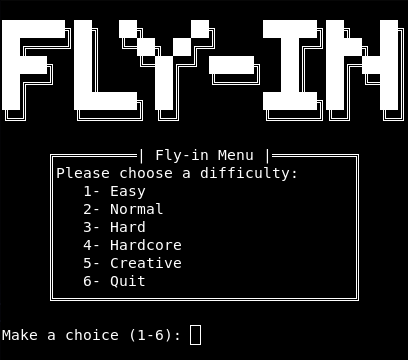
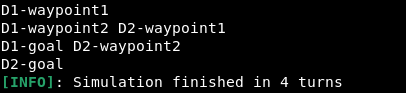
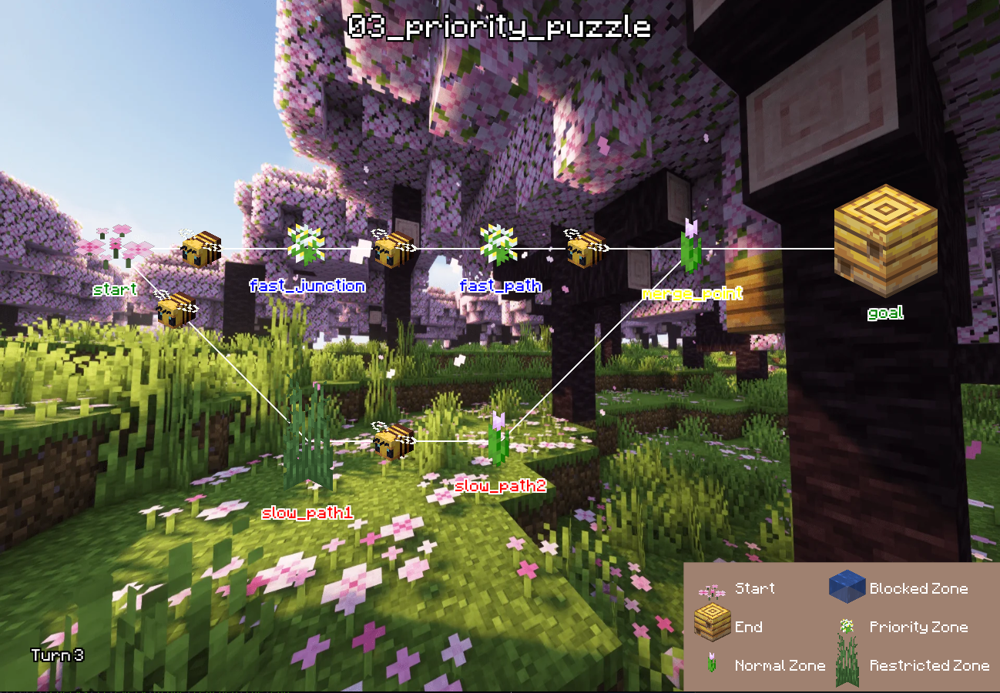

<div align="center">
    <i>This project has been created as part of the 42 curriculum by npillet</i>
    <h1>Fly-in</h1>
    <h3>Drones are interesting.</h3>
</div>

## Description
The goal of this project is to design a system that efficiently routes a fleet of drones from a starting point to an end point, all while following the different types of zones.</br>
To successfully do so, we need to choose an adapted pathfinding algorithm to move the drones across the given maps.

## Instructions
With these commands, once entered inside the terminal, the program will be able to run.
``` bash
# Both commands run the program after installing the necessary dependencies
make

uv run python -m src
---
python3 -m src # Runs the program

make visual # Runs the program with the arcade visual
```

And below, you will find other commands:
| Command | Description |
| :---: | --- |
| `make install` | Install the project's dependencies |
| `make run` | Execute the program (like the `make` command) |
| `make visual` | Execute the program with the arcade visual |
| `make output` | Execute the program and write an output file |
| `make visual-output` | Execute the program with the arcade visual and write an output file |
| `make debug` | Run the script using the Python built-in debugger |
| `make clean` | Remove temporary files and caches |
| `make lint` | Execute the `flake8` and `mypy` commands |
| `make lint-strict` | Execute the `flake8` and a stricter version of `mypy` commands |

</br>

Two flags were added in this project:
| Flags | Explanation |
| :---: | --- |
| `-v` or `--visual` | Runs the program using the arcade visual |
| `-o` or `--output` | Writes the terminal output in a file located at the root of the repository |

## Usage Example
### Input Example
Files containing the maps' data are given in this format:
```txt
nb_drones: 5

start_hub: hub 0 0 [color=green]
end_hub: goal 10 10 [color=yellow]
hub: roof1 3 4 [zone=restricted color=red]
hub: roof2 6 2 [zone=normal color=blue]
hub: corridorA 4 3 [zone=priority color=green max_drones=2]
hub: tunnelB 7 4 [zone=normal color=red]
hub: obstacleX 5 5 [zone=blocked color=gray]

connection: hub-roof1
connection: hub-corridorA
connection: roof1-roof2
connection: roof2-goal
connection: corridorA-tunnelB [max_link_capacity=2]
connection: tunnelB-goa
```
In these files, there will always be:
- nb_drones: `<number>`, as the first line</br></br>
- start_hub: `<name>` `<x>` `<y>` [metadata]
- end_hub: `<name>` `<x>` `<y>` [metadata]
- hub: `<name>` `<x>` `<y>` [metadata]</br>
For the different hubs (start, end and regulars), the metadata can be:
  - `zone=<type>` (default: **normal**) there are 4 types
  - `color=<value>` (default: **none**) can be any one word color
  - `max_drones=<number>` (default: **1**) it's the maximum drones that can occupy this zone simultaneously</br>
  The zones have different types:
    - `normal` - a standard zone that costs 1 to move
    - `blocked` - an inaccessible zone
    - `restricted` - a zone that costs 2 to move
    - `priority` - a preferred zone that costs 1 to move
- connection: `<name1>-<name2>` [metadata]</br>
For the connections, the metadata consists of:
  - `max_link_capacity=<number>` (default: **1**) it's the maximum number of drones that can traverse this connection simultaneously</br>

### Output Example
For this project, two outputs were made, one of them being mandatory.</br>
For the mandatory visual, here is the template shown below:
```bash
D<ID> # Refers to the drone (D1, D2)

<zone> # Name of the destination zone

<connection> # Name of the connection towards a restricted zone
---
# Each movement needs to be defined as such
D<ID>-<zone>

D<ID>-<connection>
```

Below is an example of the usage of this format:
```bash
D1-roof1 D2-corridorA
D1-roof2 D2-tunnelB
D1-goal D2-goal
```

## Algorithm Explanation
### Algorithm Choice
During my research for a path-finding algorithm, two of them caught my attention: <b>A*</b> and **Dijkstra**.
To determine which one to choose, I looked for the pros and cons of these two algorithms for this project.

<table>
  <tr>
    <td>&nbsp;</td>
    <th>&emsp;Dijkstra</th>
    <th>&emsp;A*</th>
  </tr>
  <tr>
    <th>Pros</th>
    <td>Much documentation, a classic and well-known algorithm</td>
    <td>Great when efficient navigation is required</td>
  </tr>
  <tr>
    <th>Cons</th>
    <td>None noticed for this use</td>
    <td>Uses coordinates (not ideal for this project as the zones have coordinates)</td>
  </tr>
</table>

For the reasons listed above, the Dijkstra algorithm is chosen to move the drones in this project.

### How does it work?
Dijkstra uses a table to keep track of every node possible.</br>
It starts by assigning a distance of 0 to the start node and every other node's values are equal to infinity. Then it chooses an unvisited node with the shortest distance and calculates the distance from the start node to this node. If the distance is shorter than the current distance, it is updated.</br>
Below is a schema to give a visual representation of the algorithm:

<div align="center">
  

  <i>The nodes are marked in red once the algorithm has visited each neighbour of the node.</i>
</div>
The algorithm complexity is: O(|E| + |V|log|V|)

## Implementation Strategy
This project is Object Oriented, meaning classes were used for a majority of aspects in the program.</br>

The drones are guided by the `Monitor` class. It uses the Dijkstra algorithm and takes into account the capacity of the zones and their connections to move the drones effectively.</br>

The visual is handled using the arcade library.

## Visualization
When starting the program, the user gets on the main menu to choose the difficulty and then the map, as shown below:</br>
<div align="center">
  
</div>

When the map is chosen, during the simulation, the terminal will display the drones' actions turn by turn. At the end, it will then print the number of turns the simulation took. Here is an example:</br>
<div align="center">
  
</div>

If the flag is used, a visual representation of the movements of the drones through it will start:</br>
<div align="center">
  
</div>
The visual here will help have a better way to visualize the drones' movements.

## Resources
### Notions
#### Path Finding Algorithms
- [Different Path Finding Algorithms](https://graphable.ai/blog/pathfinding-algorithms/)

#### Dijkstra Algorithm
- [Informations](https://en.wikipedia.org/wiki/Dijkstra%27s_algorithm)
- [Mathematical Approach](https://www.maths-cours.fr/methode/algorithme-de-dijkstra-etape-par-etape/)

- [Key Concepts And Implementation](https://major-prepa.com/python/algorithme-dijkstra/)

- [Implementation](https://www.datacamp.com/tutorial/dijkstra-algorithm-in-python?)

#### Glob Function
- [Glob](https://www.geeksforgeeks.org/python/how-to-use-glob-function-to-find-files-recursively-in-python/)

#### Arcade Library
- [Arcade Library](https://api.arcade.academy/en/stable/)

### GitHub
- [Overtekk](https://github.com/Overtekk/Fly-in)

### AI usage
AI was used to debug the code and help with the proportion in the arcade visual
